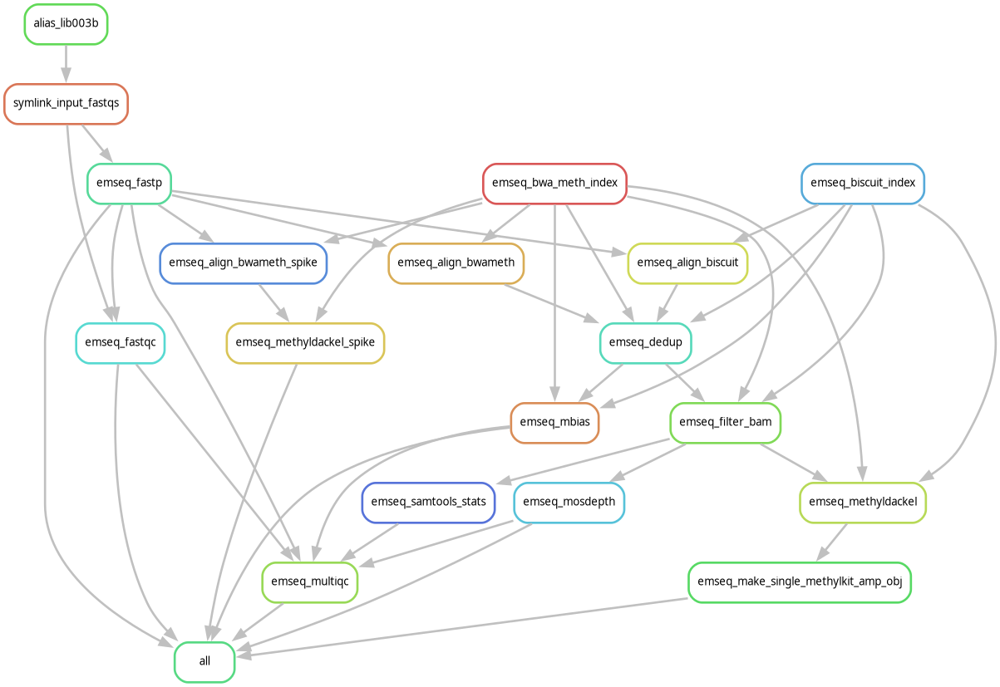
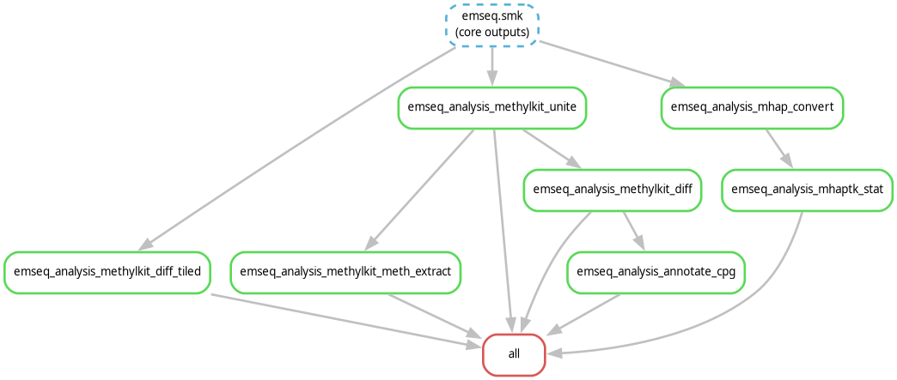

# Table of Contents

1.  [Configuration](#org9600b88)
    1.  [YAML config file](#org1e32c6c)
    2.  [Wrapper Snakefile](#org7083216)
    3.  [Resource management](#org5710c13)
    4.  [Reference assemblies](#orgde01666)
    5.  [Experiments (differential methylation)](#org29f5efe)
    6.  [Conda environments](#orge24305c)
2.  [`emseq.smk` — Core Processing](#org698066b)
    1.  [Wrapper variables](#orgdcfc65f)
    2.  [Processing steps](#orgc8b77f6)
    3.  [Outputs](#org5e02a70)
3.  [`emseq_analysis.smk` — Downstream Analysis](#orgbc443d5)
    1.  [Wrapper variables](#org6cb3954)
    2.  [Processing steps](#org20376ca)
    3.  [Outputs](#orgf64a0e7)
4.  [Testing](#orga3df2b2)
    1.  [Prerequisites](#org984b080)
    2.  [Test wrappers](#org4f757a3)
    3.  [Test data limitations](#org9fd2bb6)
5.  [Continuous Integration](#org0e1cb46)
6.  [Change Log](#org7d79cca)

The EM-seq repository provides two modular Snakemake workflows for enzymatic methylation sequencing data. Both are designed to be included from a project-specific wrapper Snakefile that defines samples, references, and resource limits.  

# Configuration

Configuration is split between a YAML config file and a wrapper Snakefile. The YAML holds all declarative settings: sample lists, reference genome definitions, tool parameters, environment paths, and resource limits. The wrapper Snakefile reads the YAML and assigns every variable that the modules consume — environments, directories, sample lists, tool parameters, and project-level decisions like which references to align against and which spike-ins were included. The wrapper also defines the `rule all` output targets and any project-specific custom rules (e.g. input symlinks, sample aliases).  

This separation serves two purposes. First, the YAML is portable across machines and projects while the wrapper encodes the specific run configuration. Second, when a project composes multiple pipeline modules (e.g. EM-seq + cfDNA CNA + fragmentation analysis), the wrapper is the single place where all variable names from all modules are visible. This makes namespace collisions immediately obvious rather than hidden inside separate module files.  

## YAML config file

Passed via `--configfile`. See `config/test.yaml` for a complete working example.  

Core keys:  

<table border="2" cellspacing="0" cellpadding="6" rules="groups" frame="hsides">

<colgroup>
<col  class="org-left" />

<col  class="org-left" />
</colgroup>
<tbody>
<tr>
<td class="org-left"><code>main-data-dir</code></td>
<td class="org-left">Root data directory; all subdirectories derived from this</td>
</tr>

<tr>
<td class="org-left"><code>library-ids</code></td>
<td class="org-left">List of sample IDs to process</td>
</tr>

<tr>
<td class="org-left"><code>keep-bed</code></td>
<td class="org-left">BED of regions to retain after filtering</td>
</tr>

<tr>
<td class="org-left"><code>exclude-bed</code></td>
<td class="org-left">BED of blacklist regions to exclude</td>
</tr>

<tr>
<td class="org-left"><code>emseq_ref_assemblies</code></td>
<td class="org-left">Nested map of reference genomes (see below)</td>
</tr>

<tr>
<td class="org-left"><code>meth-map</code></td>
<td class="org-left">Experiment definitions for differential methylation (see below)</td>
</tr>

<tr>
<td class="org-left"><code>envs</code></td>
<td class="org-left">Paths to conda environment YAMLs (<code>emseq</code>, <code>methylkit</code>, <code>haplotype</code>, <code>deconv</code>)</td>
</tr>

<tr>
<td class="org-left"><code>repos</code></td>
<td class="org-left">Paths to this repo and external tool repos</td>
</tr>

<tr>
<td class="org-left"><code>mosdepth-quant-levels</code></td>
<td class="org-left">Coverage quantization thresholds (default: <code>1,5,10,20</code>)</td>
</tr>

<tr>
<td class="org-left"><code>emseq-mincov</code></td>
<td class="org-left">Minimum coverage for methylKit (default: <code>2</code>)</td>
</tr>

<tr>
<td class="org-left"><code>fastp.extra</code></td>
<td class="org-left">Additional fastp arguments (default: none)</td>
</tr>
</tbody>
</table>

Analysis-specific keys (required only for `emseq_analysis.smk`):  

<table border="2" cellspacing="0" cellpadding="6" rules="groups" frame="hsides">

<colgroup>
<col  class="org-left" />

<col  class="org-left" />
</colgroup>
<tbody>
<tr>
<td class="org-left"><code>haplotype.cpg-ref</code></td>
<td class="org-left">Tabixed CpG reference file (hg38)</td>
</tr>

<tr>
<td class="org-left"><code>haplotype.mhb-bed</code></td>
<td class="org-left">Methylation haplotype block BED (e.g. Guo 2017 liftover)</td>
</tr>

<tr>
<td class="org-left"><code>haplotype.metrics</code></td>
<td class="org-left">List of haplotype metrics to compute (e.g. <code>[MHL, PDR, Entropy]</code>)</td>
</tr>

<tr>
<td class="org-left"><code>deconv.genome-name</code></td>
<td class="org-left">wgbstools genome identifier</td>
</tr>

<tr>
<td class="org-left"><code>deconv.atlas</code></td>
<td class="org-left">UXM deconvolution reference atlas TSV</td>
</tr>
</tbody>
</table>

## Wrapper Snakefile

The wrapper reads the YAML config and assigns every variable that the included modules expect. This is deliberate: by centralizing all variable assignments in one file, you can see at a glance every name in scope across all modules and catch collisions before they become runtime bugs. The wrapper also makes project-level decisions that do not belong in the YAML — which reference genomes to align against and which spike-in controls were included — and defines the `rule all` output targets.  

A minimal wrapper follows this structure:  

    import os
    configfile: "config/my_project.yaml"
    
    def resolve_config_paths(config_dict):
        for k, v in config_dict.items():
            if isinstance(v, str):
                config_dict[k] = os.path.expandvars(os.path.expanduser(v))
            elif isinstance(v, dict):
                resolve_config_paths(v)
            elif isinstance(v, list):
                config_dict[k] = [os.path.expandvars(os.path.expanduser(i))
                                  if isinstance(i, str) else i for i in v]
    resolve_config_paths(config)
    
    # --- Environments ---
    ENV_EMSEQ = config['envs']['emseq']
    ENV_METHYLKIT = config['envs']['methylkit']
    
    # --- Repositories ---
    R_EMSEQ = config['repos']['emseq']
    
    # --- Data directories ---
    D_DATA = config['main-data-dir']
    D_EMSEQ = f"{D_DATA}/emseq"
    D_REF = f"{D_DATA}/ref"
    D_LOGS = f"{D_DATA}/logs"
    D_BENCHMARK = f"{D_DATA}/benchmark"
    D_INPUTS = f"{D_DATA}/inputs"
    
    # --- Tool parameters ---
    MOSDEPTH_QUANT_LEVELS = config.get("mosdepth-quant-levels", "1,5,10,20")
    EMSEQ_MINCOV = config.get("emseq-mincov", 2)
    FASTP_EXTRA = config.get("fastp", {}).get("extra", "")
    EMSEQ_REF_INPUTS = {k: v['input'] for k, v in config['emseq_ref_assemblies'].items()}
    
    # --- Samples and references ---
    emseq_library_ids = config["library-ids"]
    emseq_ref_names = ["ncbi_decoy_hg38"]   # project decision
    spike_builds = ["puc19", "unmeth_lambda"]  # project decision
    KEEP_BED = config["keep-bed"]
    EXCL_BED = config["exclude-bed"]
    meth_map = config["meth-map"]
    
    rule all:
        input:
            expand(f"{D_EMSEQ}/dmr/tabix/{{lib}}.{{ref}}.bwa_meth.methyldackel.txt.bgz",
                   lib=emseq_library_ids, ref=emseq_ref_names),
            # ... additional targets
    
    include: "emseq.smk"
    include: "emseq_analysis.smk"   # optional

The test wrappers (`workflows/test.smk`, `workflows/test-analysis.smk`) and `config/example-config.yaml` serve as templates for creating project-specific wrappers.  

## Resource management

Resource management uses two mechanisms: **threads** and **concurrency**.  

**Threads** is a built-in Snakemake feature. Some rules use `threads: workflow.cores` to consume all available cores (e.g. alignment), while others use a hardcoded thread count for I/O-bound operations where more cores don't help (e.g. `threads: 8` for samtools sort, dedup, BAM filtering). Rules that use `workflow.cores` are automatically capped at the `--cores` flag value, so the same workflow runs correctly on any machine.  

**Concurrency** is a custom resource pattern using Snakemake's `resources:` directive. Each rule declares a concurrency *cost*, and a global *budget* is set at runtime via `--resources concurrency=N`. Snakemake schedules jobs as long as the total concurrency cost of running jobs stays within the budget. The system is calibrated so that a rule with `concurrency = 100` runs one at a time when `--resources concurrency=100`. On a larger machine, setting `--resources concurrency=300` allows three such jobs in parallel. Lighter-weight rules declare lower costs — for example, a rule with `concurrency = 10` allows 10 simultaneous instances at `--resources concurrency=100`, or 30 at `--resources concurrency=300`. This ratio-based approach means the same rule definitions work across machines of different sizes; only the global budget changes.  

Not every rule needs concurrency. Rules that are I/O-bound and individually lightweight (BAM filtering, samtools stats, M-bias, spike-in methylation calling) have no concurrency declaration — Snakemake schedules them freely based on available cores. Concurrency is reserved for rules that are either resource-intensive (alignment: `concurrency = 100`), memory-constrained (methylKit R jobs: `concurrency = 50`), or benefit from controlled parallelism (methylation calling, dedup: `concurrency = 25`).  

To run the pipeline, pass both `--cores` and `--resources concurrency=N`:  

    # Small machine (8 cores)
    snakemake -s workflows/test.smk --cores 8 --resources concurrency=100
    
    # Large workstation (48 cores)
    snakemake -s workflows/test.smk --cores 48 --resources concurrency=100
    
    # Very large machine (96+ cores, run more jobs in parallel)
    snakemake -s workflows/test.smk --cores 96 --resources concurrency=300

## Reference assemblies

Reference genomes are specified as a nested map in `emseq_ref_assemblies`. Each entry includes a download URL, short name, and the expected input filename. The core module handles indexing automatically. This map should include both the primary alignment reference and the spike-in control references used for conversion rate estimation.  

    emseq_ref_assemblies:
      # Primary alignment reference
      ncbi_decoy_hg38:
        url: https://ftp.ncbi.nlm.nih.gov/...
        name: ncbi_decoy_hg38
        input: GCA_000001405.15_GRCh38_no_alt_plus_hs38d1_analysis_set.fna.gz
      # Spike-in controls (EM-seq kit includes these for conversion rate QC)
      unmeth_lambda:
        url: https://www.neb.com/...
        name: unmeth_lambda
        input: lambda.fa.gz
      puc19:
        url: https://www.neb.com/...
        name: puc19
        input: pUC19.fa.gz

## Experiments (differential methylation)

The `meth-map` config key defines one or more differential methylation experiments. Each experiment specifies the samples, reference, aligner, treatment vector, and methylKit parameters.  

    meth-map:
      tumor_vs_normal:
        libs: ["sample_A", "sample_B", "sample_C", "sample_D"]
        emseq_ref_name: ["ncbi_decoy_hg38"]
        align_method: ["bwa_meth"]
        tx: [1, 1, 0, 0]
        mincov: 10
        mingroup: 1
        chunksize: "1e9"
        win_size: 10000

## Conda environments

Four conda environment YAMLs are provided in `config/`. Wrappers reference them by relative path. When running with `--use-conda`, Snakemake creates isolated prefix-based environments from these files.  

<table border="2" cellspacing="0" cellpadding="6" rules="groups" frame="hsides">

<colgroup>
<col  class="org-left" />

<col  class="org-left" />
</colgroup>
<tbody>
<tr>
<td class="org-left"><code>emseq-conda-env.yaml</code></td>
<td class="org-left">Core tools: samtools, mosdepth, R packages</td>
</tr>

<tr>
<td class="org-left"><code>methylkit-conda-env.yaml</code></td>
<td class="org-left">R/methylKit, annotatr, GenomicRanges</td>
</tr>

<tr>
<td class="org-left"><code>haplotype-conda-env.yaml</code></td>
<td class="org-left">mhaptk (Java), htslib, pytabix</td>
</tr>

<tr>
<td class="org-left"><code>deconv-conda-env.yaml</code></td>
<td class="org-left">wgbstools and UXM dependencies</td>
</tr>
</tbody>
</table>

# `emseq.smk` — Core Processing

Paired-end FASTQ files in, per-sample CpG methylation calls and QC metrics out.  

## Wrapper variables

The wrapper assigns all variables before `include: "emseq.smk"` (see the Wrapper Snakefile section for the full pattern):  

<table border="2" cellspacing="0" cellpadding="6" rules="groups" frame="hsides">

<colgroup>
<col  class="org-left" />

<col  class="org-left" />
</colgroup>
<tbody>
<tr>
<td class="org-left"><code>ENV_EMSEQ</code>, <code>ENV_METHYLKIT</code></td>
<td class="org-left">Conda environment YAML paths</td>
</tr>

<tr>
<td class="org-left"><code>R_EMSEQ</code></td>
<td class="org-left">Repository root path</td>
</tr>

<tr>
<td class="org-left"><code>D_DATA</code>, <code>D_EMSEQ</code>, <code>D_REF</code>, <code>D_LOGS</code>, <code>D_BENCHMARK</code>, <code>D_INPUTS</code></td>
<td class="org-left">Directory layout (derived from <code>main-data-dir</code>)</td>
</tr>

<tr>
<td class="org-left"><code>emseq_library_ids</code></td>
<td class="org-left">List of sample IDs (from config)</td>
</tr>

<tr>
<td class="org-left"><code>emseq_ref_names</code></td>
<td class="org-left">Reference genome names to align against (project decision)</td>
</tr>

<tr>
<td class="org-left"><code>spike_builds</code></td>
<td class="org-left">Spike-in reference names included in this run (project decision)</td>
</tr>

<tr>
<td class="org-left"><code>EMSEQ_REF_INPUTS</code></td>
<td class="org-left">Dict mapping ref name → input FASTA filename</td>
</tr>

<tr>
<td class="org-left"><code>KEEP_BED</code>, <code>EXCL_BED</code></td>
<td class="org-left">Region filter BED file paths</td>
</tr>

<tr>
<td class="org-left"><code>meth_map</code></td>
<td class="org-left">Experiment map for differential methylation</td>
</tr>

<tr>
<td class="org-left"><code>MOSDEPTH_QUANT_LEVELS</code></td>
<td class="org-left">Coverage quantization thresholds (default: <code>1,5,10,20</code>)</td>
</tr>

<tr>
<td class="org-left"><code>EMSEQ_MINCOV</code></td>
<td class="org-left">Minimum coverage for methylKit (default: <code>2</code>)</td>
</tr>

<tr>
<td class="org-left"><code>FASTP_EXTRA</code></td>
<td class="org-left">Additional fastp arguments (default: none)</td>
</tr>
</tbody>
</table>

## Processing steps

-   **Trimming and QC**: Adapter removal and quality trimming (fastp), read quality assessment before and after trimming (FastQC)
-   **Alignment**: Bisulfite-aware alignment to one or more reference genomes via BWA-meth and/or Biscuit, coordinate sorting
-   **Duplicate handling**: Duplicate marking with dupsifter, then BAM filtering that removes marked duplicates along with secondary, supplementary, and failed QC reads
-   **Methylation calling**: CpG methylation extraction in methylKit format (MethylDackel), per-sample methylKit object creation, tabix indexing
-   **Coverage**: Depth profiling with threshold summaries and quantization tracks (mosdepth), aggregated coverage plots
-   **Spike-in controls**: Alignment to pUC19 (methylated) and Lambda (unmethylated) spike-in references for conversion rate estimation
-   **Bias detection**: Position-dependent methylation bias assessment (MethylDackel mbias)
-   **Reporting**: Aggregated QC report (MultiQC)

**Design decision — duplicate marking vs. removal:** Deduplication is deliberately split into two rules. `emseq_dedup` uses dupsifter to **mark** duplicates (SAM flag 0x400) without removing them. `emseq_filter_bam` then **removes** marked duplicates as part of a combined filter (`-F 3840`: secondary + supplementary + failed QC + duplicates) while also requiring proper pairs (`-f 2`), MAPQ ≥ 30, and intersection with keep/exclude BED regions. Separating these steps ensures that the marked-but-unfiltered BAM is available for M-bias assessment, where the full read set is needed to accurately detect position-dependent biases before duplicate removal.  

  

## Outputs

<table border="2" cellspacing="0" cellpadding="6" rules="groups" frame="hsides">

<colgroup>
<col  class="org-left" />

<col  class="org-left" />
</colgroup>
<tbody>
<tr>
<td class="org-left"><code>emseq/fastqs/{lib}.trimmed_{R1,R2}.fastq.gz</code></td>
<td class="org-left">Adapter-trimmed paired-end reads</td>
</tr>

<tr>
<td class="org-left"><code>emseq/bams/{lib}.{ref}.{aligner}.coorsort.deduped.bam</code></td>
<td class="org-left">Coordinate-sorted BAM with duplicates marked (not removed)</td>
</tr>

<tr>
<td class="org-left"><code>emseq/bams/{lib}.{ref}.{aligner}.coorsort.filt.bam</code></td>
<td class="org-left">Final filtered BAM: duplicates removed, MAPQ ≥ 30, proper pairs, on-target</td>
</tr>

<tr>
<td class="org-left"><code>emseq/dmr/tabix/{lib}.{ref}.{aligner}.methyldackel.txt.bgz</code></td>
<td class="org-left">Per-CpG methylation calls, tabix-indexed</td>
</tr>

<tr>
<td class="org-left"><code>emseq/meth/{lib}.{ref}.{aligner}_methyldackel_CpG.methylKit</code></td>
<td class="org-left">Per-sample methylKit object</td>
</tr>

<tr>
<td class="org-left"><code>emseq/spike/{lib}.{spike}.{aligner}_methyldackel_CpG.methylKit</code></td>
<td class="org-left">Spike-in methylation calls for conversion rate estimation</td>
</tr>

<tr>
<td class="org-left"><code>emseq/qc/{lib}.{raw,trimmed}_{R1,R2}_fastqc.{html,zip}</code></td>
<td class="org-left">Per-sample FastQC reports (pre- and post-trimming)</td>
</tr>

<tr>
<td class="org-left"><code>emseq/qc/{lib}.{ref}.{aligner}_emseq_mbias.txt</code></td>
<td class="org-left">M-bias profile for position-dependent bias detection</td>
</tr>

<tr>
<td class="org-left"><code>emseq/qc/mosdepth_{lib}.{ref}.{aligner}.mosdepth.summary.txt</code></td>
<td class="org-left">Coverage depth summary with threshold and quantization tracks</td>
</tr>

<tr>
<td class="org-left"><code>emseq/qc/{lib}_emseq_fastp.{html,json}</code></td>
<td class="org-left">Fastp trimming report</td>
</tr>

<tr>
<td class="org-left"><code>emseq/qc/multiqc.html</code></td>
<td class="org-left">Aggregated QC report across all samples</td>
</tr>
</tbody>
</table>

# `emseq_analysis.smk` — Downstream Analysis

Filtered BAMs and methylation calls in, differential methylation results, haplotype metrics, and tissue deconvolution out.  

## Wrapper variables

All core variables (above), plus these analysis-specific variables assigned in the wrapper:  

<table border="2" cellspacing="0" cellpadding="6" rules="groups" frame="hsides">

<colgroup>
<col  class="org-left" />

<col  class="org-left" />
</colgroup>
<tbody>
<tr>
<td class="org-left"><code>ENV_HAPLOTYPE</code>, <code>ENV_DECONV</code></td>
<td class="org-left">Conda environment YAML paths for haplotype and deconvolution</td>
</tr>

<tr>
<td class="org-left"><code>R_MHAPTOOLS</code>, <code>R_WGBSTOOLS</code>, <code>R_UXM</code></td>
<td class="org-left">Paths to cloned external tool repositories</td>
</tr>

<tr>
<td class="org-left"><code>CPG_REF</code></td>
<td class="org-left">Tabixed CpG reference file (hg38)</td>
</tr>

<tr>
<td class="org-left"><code>MHB_BED</code></td>
<td class="org-left">Methylation haplotype block BED (e.g. Guo 2017 liftover)</td>
</tr>

<tr>
<td class="org-left"><code>HAP_METRICS</code></td>
<td class="org-left">Space-separated haplotype metric names</td>
</tr>

<tr>
<td class="org-left"><code>DECONV_GENOME</code></td>
<td class="org-left">wgbstools genome identifier</td>
</tr>

<tr>
<td class="org-left"><code>DECONV_ATLAS</code></td>
<td class="org-left">UXM deconvolution reference atlas TSV</td>
</tr>
</tbody>
</table>

External tool repositories must be cloned before running (see `tools/setup_repos.sh`).  

## Processing steps

-   **Differential methylation**: Per-sample methylKit unite across an experiment, differential methylation calling at both per-base and tiled (windowed) resolution, extraction of positional methylation values for significant sites (methylKit)
-   **CpG annotation**: Genomic feature annotation of differentially methylated regions — CpG islands, shores, shelves, inter-CGI regions, gene promoters, exons, introns (annotatr)
-   **Methylation haplotypes**: BAM-to-mhap format conversion (mHapTools), per-MHB haplotype metrics including MHL, PDR, and entropy (mhaptk)
-   **Tissue deconvolution**: Chromosome-prefix BAM reheading, pat/beta file generation (wgbstools), cell-type-of-origin deconvolution against a reference atlas (UXM)

  

## Outputs

<table border="2" cellspacing="0" cellpadding="6" rules="groups" frame="hsides">

<colgroup>
<col  class="org-left" />

<col  class="org-left" />
</colgroup>
<tbody>
<tr>
<td class="org-left"><code>emseq/dmr/diff/methylBase_{experiment}.txt.bgz</code></td>
<td class="org-left">United methylation data across samples, tabix-indexed</td>
</tr>

<tr>
<td class="org-left"><code>emseq/dmr/diff/methylDiff_{experiment}.txt.bgz</code></td>
<td class="org-left">Differentially methylated CpGs (per-base), tabix-indexed</td>
</tr>

<tr>
<td class="org-left"><code>emseq/dmr/diff/methylBase_{experiment}.tiled.txt.bgz</code></td>
<td class="org-left">Tiled (windowed) united methylation data</td>
</tr>

<tr>
<td class="org-left"><code>emseq/dmr/diff/{experiment}_pos_meth.tsv</code></td>
<td class="org-left">Positional methylation values for significant sites</td>
</tr>

<tr>
<td class="org-left"><code>emseq/dmr/annotation/{experiment}_annotated.tsv</code></td>
<td class="org-left">DMRs annotated with genomic features (CpG islands, promoters, etc.)</td>
</tr>

<tr>
<td class="org-left"><code>emseq/haplotype/{lib}.{ref}.{aligner}.mhap.gz</code></td>
<td class="org-left">Methylation haplotype calls per read (mhap format), tabix-indexed</td>
</tr>

<tr>
<td class="org-left"><code>emseq/haplotype/{lib}.{ref}.{aligner}_mhl.txt</code></td>
<td class="org-left">Per-MHB haplotype metrics (MHL, PDR, entropy)</td>
</tr>

<tr>
<td class="org-left"><code>emseq/deconv/{lib}.{ref}.{aligner}.chr.pat.gz</code></td>
<td class="org-left">Per-read methylation patterns for deconvolution (wgbstools pat format)</td>
</tr>

<tr>
<td class="org-left"><code>emseq/deconv/{lib}.{ref}.{aligner}.chr.beta</code></td>
<td class="org-left">Per-CpG average methylation (wgbstools beta format)</td>
</tr>

<tr>
<td class="org-left"><code>emseq/deconv/uxm_results.csv</code></td>
<td class="org-left">Cell-type-of-origin deconvolution fractions across all samples</td>
</tr>
</tbody>
</table>

# Testing

The repository includes in-repo test data and wrapper Snakefiles for both modules. Test data consists of real EM-seq reads subsetted to chr22 with matching spike-in references (pUC19, Lambda), blacklist regions, and analysis references (CpG sites, MHB blocks).  

## Prerequisites

The analysis pipeline requires three external tool repositories. Clone and build them before running:  

    # Clone mHapTools, wgbs_tools, UXM_deconv
    ./tools/setup_repos.sh
    
    # wgbs_tools must be built inside the deconv conda env (the setup script
    # runs python setup.py, but the C extensions require the conda env's htslib)

## Test wrappers

-   `workflows/test.smk` — tests the core module (`emseq.smk`) end-to-end: FASTQ → trimming → alignment (BWA-meth + Biscuit) → dedup → filter → methylation calling → QC
-   `workflows/test-analysis.smk` — tests the analysis module (`emseq_analysis.smk`): DMR calling → annotation
-   `config/test.yaml` — shared test configuration defining samples, references, experiments, and conda environments

To run locally:  

    # Core pipeline
    snakemake -s workflows/test.smk --configfile config/test.yaml --cores 4 --use-conda --resources concurrency=100
    
    # Analysis pipeline (requires core outputs + external repos)
    snakemake -s workflows/test-analysis.smk --configfile config/test.yaml --cores 4 --use-conda --resources concurrency=100

## Test data limitations

The in-repo test data is subsetted to chr22 to keep the repository small. This is sufficient for validating the full core pipeline and the DMR/annotation portion of the analysis pipeline. Two analysis features are excluded from CI testing and included as commented-out targets in the test wrapper:  

-   **Methylation haplotypes** (mHapTools/mhaptk) — mHapTools requires C++ compilation from source with a bundled htslib version; too fragile for CI runners.
-   **Tissue deconvolution** (wgbstools/UXM) — requires broader genomic coverage than a single chromosome provides.

Both have been validated on production-scale data.  

# Continuous Integration

**Core processing (emseq.smk):**

**Downstream analysis (emseq_analysis.smk):**

# Change Log

-   Development since last tag  
    -   [2026-03-31 Tue]  Major README and CI overhaul:  
        -   Split README into per-module documentation with consistent structure (intro, wrapper variables, processing steps, DAG, outputs).
        -   Added Configuration section: YAML/wrapper architecture, resource management with basecamp concurrency model.
        -   Reverted to direct thread/concurrency values per rule (basecamp pattern).
        -   Added analysis CI workflows (`smk-analysis-dry`, `smk-analysis-run`). All four CI workflows pass.
        -   Analysis CI tests DMR + annotation; haplotypes and deconvolution excluded (validated on production data only — mHapTools requires source compilation, UXM needs broader coverage than chr22).
        -   Added test reference fixtures: chr22 CpG ref, MHB BED, UXM atlas subset.
        -   Removed project-specific AERO wrapper files.
    -   [2026-03-25 Wed]  Production validation fixes:  
        -   Added `mkdir -p` to `emseq_align_bwameth_spike` shell block for samtools sort tmp dir.
        -   Added `wildcard_constraints: experiment = "[^.]+"` to `emseq_analysis_methylkit_unite` and `emseq_analysis_methylkit_diff` to prevent greedy matching of `.tiled` suffix.
        -   Haplotype conda env: added `mhaptk`, `pandas`, `matplotlib`, `scipy`, `seaborn`, `tqdm` as pip deps.
        -   Fixed mosdepth quantize string bug (single → global comma replacement).
    -   [2026-03-16 Mon]  Added emseqanalysis.smk module: DMR (migrated from emseq.smk), methylation haplotypes (mHapTools/mhaptk), tissue deconvolution (wgbstools/UXM), CpG annotation. New conda envs, test-analysis.smk wrapper, reference preparation docs.
    -   Added CI workflows: core dry-run, core full run, analysis dry-run, analysis full run.
-   wf/emseq/v4.0.0  
    -   Minor testing updates
    -   Fixed test.yaml file locations
    -   Changed bam filtering step to remove duplicates marked by dupsifter. So rule emseqdedup MARKS duplicates while rule emseqfilterbam removes them as part of \`samtools view -@ {threads} -u -f 2 -q 30 -F 3840 "{input.bam}\`
    -   Changed mosdepth to take filtered bam and quantify by keep.bed, ignoring filtered regions in depth calculation.
    -   Conforms to [v1.3 snakemake style guide](https://github.com/jeszyman/basecamp/blob/v1.3.0/docs/snakemake-style-guide.md)
-   wf/emseq/v3.1.0  
    -   [2025-09-19 Fri]  Added a first github workflow test
    -   [2025-09-19 Fri]  Robust annotation of methylkit outputs validated as rscript
    -   [2025-09-19 Fri]  Added mature github tests for building in-repo test data and smkdry
-   [2025-09-19 Fri]  Updated EM-seq main pipeline to wf/emseq/v3.0.0.  
    -   Includes in-repo small test data for a complete run of emseq.smk
    -   Includes test.smk wrapper and corresponding test.yaml for in-repo small test run
    -   emseq.smk expanded to include differential methylation from nested list map
    -   Many small fixes for consistent naming and run condition optimization
-   [2025-09-18 Thu]  Updated EM-seq main pipeline to wf/emseq/v2.0.0. Mainly improved and simplified variable naming.

