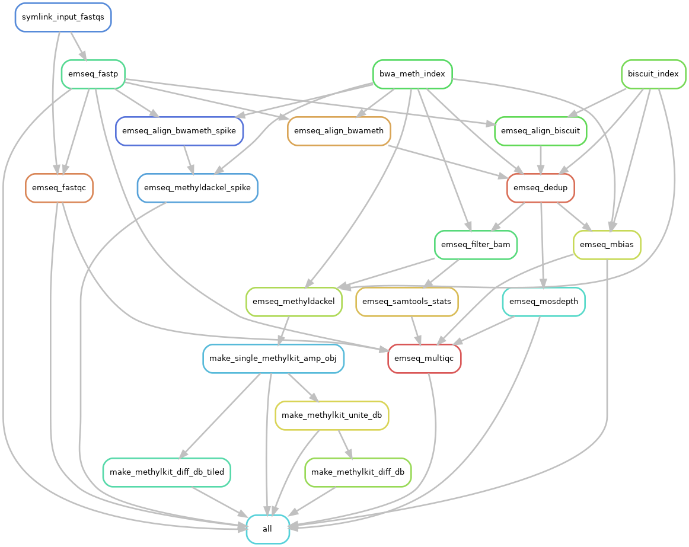

The EM-seq repository contains modular workflows intended to be run from within a over-wrapping snakemake workflow.  

Current stable version tested with minimal in-repo example is tagged emseq.v3.1.0.  

  

# Continuous Integration

# Change Log

-   Development since last tag
-   wf/emseq/v4.0.0  
    -   Minor testing updates
    -   Fixed test.yaml file locations
    -   Changed bam filtering step to remove duplicates marked by dupsifter. So rule emseq\_dedup MARKS duplicates while rule emseq\_filter\_bam removes them as part of \`samtools view -@ {threads} -u -f 2 -q 30 -F 3840 "{input.bam}\`
    -   Changed mosdepth to take filtered bam and quantify by keep.bed, ignoring filtered regions in depth calculation.
    -   Conforms to [v1.3 snakemake style guide](https://github.com/jeszyman/basecamp/blob/v1.3.0/docs/snakemake-style-guide.md)
-   wf/emseq/v3.1.0  
    -   [2025-09-19 Fri]  Added a first github workflow test
    -   [2025-09-19 Fri]  Robust annotation of methylkit outputs validated as rscript
    -   [2025-09-19 Fri]  Added mature github tests for building in-repo test data and smk\_dry
-   [2025-09-19 Fri]  Updated EM-seq main pipeline to wf/emseq/v3.0.0.  
    -   Includes in-repo small test data for a complete run of emseq.smk
    -   Includes test.smk wrapper and corresponding test.yaml for in-repo small test run
    -   emseq.smk expanded to include differential methylation from nested list map
    -   Many small fixes for consistent naming and run condition optimization
-   [2025-09-18 Thu]  Updated EM-seq main pipeline to wf/emseq/v2.0.0. Mainly improved and simplified variable naming.

